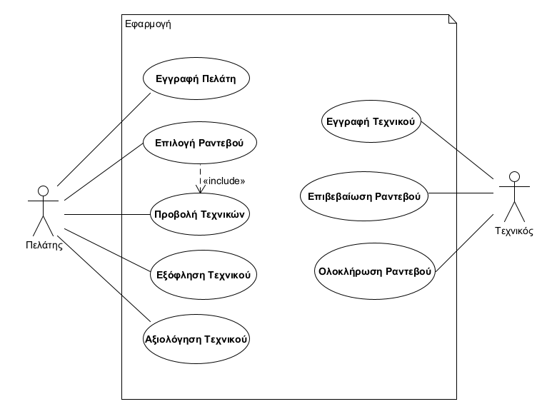

# INF138 Project Template

Ένα απλό πρότυπο οργάνωσης του κώδικα και της τεχνικής τεκμηρίωσης για τις εξαμηνιαίες εργασίες του μαθήματος Τεχνολογία Λογισμικού ([INF138](https://eclass.aueb.gr/courses/INF138/)) του Τμήματος Πληροφορικής Οικονομικού Πανεπιστημίου Αθηνών.

Η τρέχουσα έκδοση περιλαμβάνει την [προδιαγραφή των απαιτήσεων λογισμικού](docs/markdown/software-requirements.md) με προσαρμογή του `IEEE Std 830-1998` για την ενσωμάτωση απαιτήσεων σε μορφή περιπτώσεων χρήσης. Για περισσότερες λεπτομέρειες μπορείτε να ανατρέξετε στο βιβλίο [Μ Γιακουμάκης, Ν. Διαμαντίδης, Τεχνολογία Λογισμικού, Σταμούλης, 2009](https://www.softeng.gr).

# Οδηγίες χρήσης

Στην παρούσα αρχική σελίδα `README.md` προσθέστε σε μορφή Markdown την περιγραφή του Project όπως σας ζητείται στο παραδοτέο R1. Στη σελίδα αυτή θα προστεθούν σύνδεσμοι προς τα έγγραφα Markdown που περιλαμβάνουν την προδιαγραφή και ανάλυση των απαιτήσεων [software-requirements.md](docs/markdown/software-requirements.md) και τη σχεδίαση του συστήματος [design.md](docs/markdown/design.md).

Η τεκμηρίωση/διαγράμματα που ζητούνται στα επόμενα παραδοτέα θα τοποθετηθούν στους εξής φακέλους:
* `docs/markdown`: αρχεία Markdown με την τεκμηρίωση του συστήματος που απαιτείται για τα παραδοτέα R2-R4. H τεκμηρίωση θα συμπεριληφθεί στα ακόλουθα αρχεία:
     *  `software-requirements.md`: προδιαγραφή και ανάλυση των απαιτήσεων. Προκειμένου να διευκολυνθεί η συνεργασία σας, οι περιγραφές των περιπτώσεων χρήσης μπορούν να εισαχθούν σε διαφορετικά αρχεία `*.md`. Προϋπόθεση είναι να υπάρχουν κατάλληλοι σύνδεσμοι από το `software-requirements.md` προς αυτά έτσι ώστε να διευκολύνεται η πλοήγηση στην τεκμηρίωση μέσω του Gitlab. Τα διαγράμματα που θα δημιουργηθούν στα πλαίσια του R2 θα ενσωματωθούν στα παραπάνω έγγραφα (δεν θα λάβουμε υπόψιν διαγράμματα με μορφή εικόνας/uxf που δεν θα φαίνονται ως μέρος της τεκμηρίωσης).
     *  `design.md`: περιγραφή της σχεδίασης του συστήματος όπως ζητείται στα παραδοτέα R3 και R4. To έγγραφο θα ενσωματώνει όλα τα διαγράμματα που θα δημιουργηθούν στα παραδοτέα R3, R4. Οι εικόνες των διαγραμμάτων θα είναι διαθέσιμες στο φάκελο `docs/markdown/uml`, όπως παράγονται από το εργαλείο Gradle.
* `docs/uml`: αρχεία Umlet (`*.uxf`) με τα διαγράμματα που έχουν υλοποιηθεί στα πλαίσια των παραδοτέων R2-R4. Μπορούν να οργανωθούν σε υποφακέλους (πχ. `requirements`, `design`).

Η αυτοματοποιημένη μετατροπή των διαγραμμάτων Umlet σε PNG εικόνες, έτοιμες προς ενσωμάτωση στην Markdown τεκμηρίωσή σας μπορεί να γίνει με χρήση του εργαλείου Gradle. Προϋπόθεση για τη σωστή λειτουργία της διαδικασίας είναι η [λήψη](https://maven.apache.org/download.cgi), [εγκατάσταση](https://maven.apache.org/install.html) και προσθήκη στο PATH του συστήματος του εργαλείου Maven.

Μετά την εγκατάσταση του Maven, μπορείτε να παράξετε όλα τα διαγράμματα που βρίσκονται στον κατάλογο `docs\uml` (και υποκαταλόγους) με τη βοήθεια του Gradle (δε χρειάζεται εγκατάσταση):

Από γραμμή εντολών Windows:
```bash
gradlew.bat umlet
```

Από γραμμή εντολών Linux:
```bash
./gradlew umlet
```

Η εκτέλεση της εντολής θα εγκαταστήσει το Gradle και θα παράξει τα διαγράμματα στον κατάλογο `docs\markdown\uml` διατηρώντας την οργάνωση σε καταλόγους των Umlet αρχείων. Στη συνέχεια, μπορείτε να ενσωματώσετε στην τεκμηρίωσή σας τις εικόνες του παραπάνω καταλόγου.

# Πεδίου προβλήματος

### Σύντομη περιγραφή

Η εφαρμογή θα διευκολύνει την εύρεση του κατάλληλου τεχνικού για επισκευή διαφόρων βλαβών στο σπίτι. Οι χρήστες θα είναι είτε τεχνικοί είτε πελάτες. Οι τεχνικοί θα κάνουν εγγραφή και θα εντάσσονται σε μια από τις διαθέσιμες κατηγορίες-ειδικότητες. Θα δηλώνουν  τις  περιοχές  τις  οποίες  εξυπηρετούν, τις εργασίες τις  οποίες προσφέρουν,  τις  μέρες  και  ώρες  τις  οποίες  είναι  διαθέσιμοι, τρόπους επικοινωνίας καθώς και τις τιμές. Οι πελάτες θα μπορούν να μπαίνουν στην εφαρμογή χωρίς εγγραφή και να βλέπουν τα στοιχεία των εγγεγραμμένων τεχνικών. Κάνοντας εγγραφή θα μπορούν να κλείσουν ραντεβού με τεχνικό της επιλογής τους. Η αναζήτηση των τεχνικών θα γίνεται με βάση την ειδικότητα, την περιοχή, τη διαθεσιμότητα και την τιμή ανά προσφερόμενη εργασία. Η εφαρμογή θα προβάλλει μόνο τις διαθέσιμες ώρες για τα ραντεβού. Όταν ο πελάτης κλείσει κάποιο ραντεβού η εφαρμογή θα ενημερώνει τον τεχνικό με τον τρόπο που αυτός έχει επιλέξει (e-mail, τηλ, SMS) και αυτός θα μπαίνει στην εφαρμογή για να επιβεβαιώσει το ραντεβού. Με την επιβεβαίωση η εφαρμογή θα στέλνει e-mail στον πελάτη για την επιβεβαίωση του ραντεβού και θα δεσμεύει το συγκεκριμένο ραντεβού για τον συγκεκριμένο τεχνικό ώστε να μην είναι πλέον διαθέσιμο.Με την ολοκλήρωση της εργασίας η εφαρμογή θα επιτρέπει την εξόφληση και αξιολόγηση του τεχνικού.


### Απαρίθμηση απαιτήσεων

1. Οι χρήστες έχουν την δυνατότητα να εγγράφονται στην εφαρμογή ως ***πελάτες*** ή ως ***τεχνικοί***.
3. Οι τεχνικοί ανήκουν σε ορισμένες κατηγορίες-ειδικότητες.
4. Μη εγγεγραμμένοι πελάτες μπορούν να δουν τα στοιχεία των τεχνικών.
5. Οι εγγεγραμμένοι πελάτες έχουν την δυνατότητα να κλείσουν ραντεβού με τεχνικούς.
6. Η εφαρμογή προσφέρει την δυνατότητα σε εγγεγραμμένους πελάτες να δεσμεύουν ***ραντεβού*** με τεχνικόυς.
10. Οι πελάτες μπορούν να αξιολογούν τους τεχνικούς.
11. Οι πελάτες μπορούν να εξοφλήσουν τους τεχνικούς.

### Διάγραμμα περιπτώσεων χρήσης



### Ανάλυση των απαιτήσεων του συστήματος

Η ανάλυση των απαιτήσεων συστήματος περιγράφεται αναλυτικά [εδώ](docs/markdown/software-requirements.md).