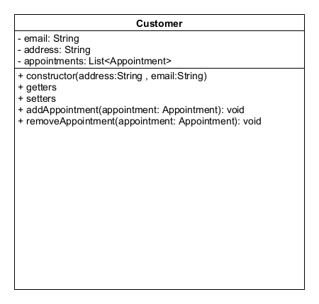
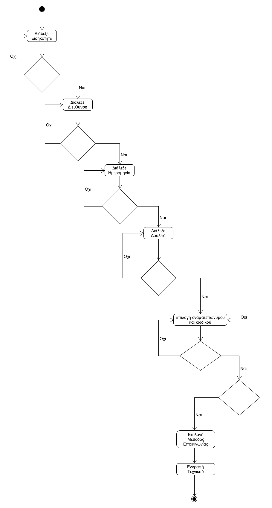

# Περιγραφή κλάσεων του συστήματος

## User

### Περιγραφή κλάσης

Το interface *User* αποτελεί το αρχέτυπο για τον *Customer* και τον *Technician*. Μέσω της *User* υλοποιούνται οι λειτουργίες ασφαλής αποθήκευσης κωδικών με χρήση του αλγορίθμου SHA-1 και η εγγύηση πως οι δωσμένοι κωδικοί κατά την εγγραφή ενός χρήστη ταιριάζουν

### Διάγραμμα κλάσης


## Appointment

### Περιγραφή κλάσης

Η κλάση *Appointment* συμβολίζει ένα ραντεβού μεταξύ ενός *πελάτη* και ενός *τεχνικού*. Η κλάση σχετίζεται με τις κλάσεις *Payment*, *Customer* και *Job*. Ιδιατερότητα της εν λόγω κλάσης αποτελεί το γεγονός ότι η κλάση δημιουργεί και συσχετίζεται με μία οντότητα της *Payment*. O constructor της κλάσης δίνεται παρακάτω.

```
public Appointment(Date from, Date to,double amount) {
    this.from = from;
    this.to = to;
    this.completed = false;
    this.confirmed = false;
    setPayment(new Payment(amount));
    this.jobs = new ArrayList<>();
}
```

### Διάγραμμα κλάσης


### Υλοποίηση των συσχετίσεων

#### Payment

Η *Payment* με την *Appointment* διατηρούν μία σχέση ένα προς ένα. Οπότε, η *Appointment* κρατάει μία οντότητα της *Payment* και έχει τους ακόλουθους getter και setter.

```
public Payment getPayment() {
    return payment;
}

public void setPayment(Payment payment) {
    this.payment = payment;
    this.payment.setAppointment(this);
}
```

#### Customer

Η κλάση *Appointment* διαθέτει ένα instance της *Customer*.

#### Job

Η *Appointment* και η *Job* συνδέονται με σχέση πολλά προς πολλά. Για αυτό το λόγο η *Appointment* διατηρεί μία λίστα με οντότητες τύπου *Job*. Η λίστα ανανεώνεται με τις ακόλουθες μεθόδους.

```
public void addJob(Job job) {
    if(!jobs.contains(job)){
        jobs.add(job);
        job.addAppointment(this);
    }
}

public void removeJob(Job job) {
    if(jobs.contains(job)){
        jobs.remove(job);
        job.removeAppointment(this);
    }
}
```

## AvailableDate

### Περιγραφή κλάσης

Η κλάση *AvailableDate* συμβολίζει μία ημερομηνία στην οποία ο *Technician* είναι διαθέσιμος. Η μεταβλητή booked της κλάσης δηλώνει εάν ο *τεχνικός* έχει ραντεβού σε αυτή την ημερομηνία.

### Διάγραμμα κλάσης


## Customer

### Περιγραφή κλάσης

H *Customer* αναπαριστά έναν *πελάτη* της εφαρμογής και επεκτείνει την κλάση *User*. Αναγνωριστικό ενός *πελάτη* αποτελεί το email του, το οποίο αποθηκεύεται στην κλάση *Customer*.

### Διάγραμμα κλάσης



### Υλοποίηση των συσχετίσεων

#### Appointment

Η *Customer* συνδέεται με την *Appointment* μέσω μίας one-to-many συσχέτισης. Αυτό σημαίνει πως ο *Customer* είναι υποχρεωμένος να κρατάει οντότητες τύπου *Appointment* σε μία λίστα. Τα περιεχόμενα της λίστας με τα *ραντεβού* διατρέχονται και μεταβάλλονται με τις παρακάτω μεθόδους. Ιδιατερότητα της υλοποίησης του πελάτη αποτελεί η μέθοδος `boolean checkPasswords(String, String)`, η οποία συγκρίνει δύο κωδικούς και επιστρέφει αληθής ή ψευδής ανάλογα με το αποτέλεσμα.

```
public List<Appointment> getAppointments() {
    return appointments;
}

public void addAppointment(Appointment appointment) {
    if(!appointments.contains(appointment)){
        appointments.add(appointment);
        appointment.setCustomer(this);
    }
}

public void removeAppointment(Appointment appointment) {
    if (appointments.contains(appointment)) {
        appointments.remove(appointment);
        appointment.setCustomer(null);
    }
}
```

## Job

### Περιγραφή κλάσης

Η κλάση *Job* υλοποιεί τις διαθέσιμες δουλειές που μπορεί να εκτελέσει ένας *τενικός*. Κάθε δουλειά χρειάζεται ένα όνομα(πχ "Wall painting" ή "Pipe changing") και μία τιμή.

### Διάγραμμα κλάσης


### Υλοποίηση των συσχετίσεων

#### Technician

Η *Job* διατηρεί μία οντότητα τύπου *Technician*.

#### Appointment

Η *Job* υλοποιεί την δικιά της πλευρά της many-to-many συσχέτισης με την *Appointment*.

```
public List<Appointment> getAppointments() {
    return appointments;
}

public void addAppointment(Appointment appointment) {
    if(!appointments.contains(appointment)){
        appointments.add(appointment);
        appointment.addJob(this);
    }
}

public void removeAppointment(Appointment appointment) {
    if (appointments.contains(appointment)) {
        appointments.remove(appointment);
        appointment.removeJob(this);
    }
}
```

## Payment

### Περιγραφή κλάσης

Η κλάση *Payment* συμβολίζει μία πληρωμή ενός *πελάτη* για ένα *ραντεβού*.

### Διάγραμμα κλάσης


### Υλοποίηση των συσχετίσεων

#### Appointment

Η *Payment* και η *Appointment* σχετίζονται με μία ένα προς ένα σύνδεση.

```
public Appointment getAppointment() {
    return appointment;
}

public void setAppointment(Appointment appointment) {
    this.appointment = appointment;
}
```

## Technician

### Περιγραφή κλάσης

Ένα *τεχνικός* αναπαριστάται από την κλάση *Technician*. Τα στοιχεία επικοινωνίας του *τεχνικού* δίνονται από τις μεταβλητές `communicationType` και `communicationValue`. Η πρώτη μεταβλητή αποθηκεύει τον τύπο επικοινωνίας που έχει επιλέξει ο *τεχνικός*(Email, SMS ή Phone) και η δεύτερη την τιμή του τύπου επικοινωνίας(πχ test@example.com).

### Διάγραμμα κλάσης


### Υλοποίηση των συσχετίσεων

#### AvailableDate

Η κλάση διαθέτει λίστες με τις ημερομηνίες που ο *τεχνικός* είναι διαθέσιμος.

```
public List<AvailableDate> getAvailableDates() {
    return availableDates;
}

public void addAvailableDate(AvailableDate date){
    if(!availableDates.contains(date)){
        availableDates.add(date);
        date.setTechnician(this);
    }
}
public void removeAvailableDate(AvailableDate date){
    if(availableDates.contains(date)){
        availableDates.remove(date);
        date.setTechnician(null);
    }
}
```

#### Specialty

Οι ειδικότητες του *τεχνικού* αποθηκεύονται σε μία λίστα από *Specialty*.

```
public void setSpecialties(List<Specialty> specialties) {
    this.specialties = specialties;
}

public List<Specialty> getSpecialties() {
    return specialties;
}

public void addSpecialty(Specialty specialty) {
    if (!specialties.contains(specialty))
        specialties.add(specialty);
}

public void removeSpecialty(List<Specialty> special) {
    specialties.remove(special);
}
```

#### Job

Οι *δουλειές* που μπορεί να κάνει ένας τεχνικός διατηρούνται σε μία λίστα απο οντότητες τύπου *Job*.

```
public List<Job> getJobs() {
    return jobs;
}

public void addJob(Job job) {
    if(!jobs.contains(job)){
        jobs.add(job);
        job.setTechnician(this);
    }
}

public void removeJob(Job job) {
    if(jobs.contains(job)){
        jobs.remove(job);
        job.setTechnician(null);
    }
}
```

# Υλοποίηση διαγραμμάτων από τις κλάσεις του μοντέλου πεδίου

Όλες οι περιπτώσεις χρήσης του συστήματος βασίζονται στo UI της εφαρμογής. Για αυτό το λόγο δεν είναι σε θέση να υλοποιηθούν τα διαγράμματα με ακρίβεια μέχρι και το βήμα R4. Παρόλα αυτά, φτιάξαμε παραδείγματα κώδικα για όλα τα διαγράμματα των σημαντικότερων περιπτώσεων χρήσης, έτσι ώστε να αποδείξουμε ότι οι κλάσεις που φτιάξαμε μπορούν να συνδυαστούν και να παράξουν τη λογική των διαγραμμάτων. Υποθέτουμε ότι ο χρήστης επικοινωνεί με την εφαρμογή μέσω μίας υποθετικής κλάσης εν ονόματι `UI`.

### [ΠΧ 2 - Εγγραφή Τεχνικού](uc2-technician-registration.md)

#### Διάγραμμα



#### Πιθανή υλοποίηση

```
// Specialties
List<Specialty> specialties = new ArrayList<>();
do {
    // User adds specialty builder via UI
    specialties.add(UI.input());
} while (specialties.size() == 0);

// Addresses
List<String> addresses = new ArrayList<>();
do {
    addresses.add(UI.input());
} while (addresses.size() == 0);

// Rest of the data
String username = UI.input();
List<Job> jobs = UI.input();
List<AvailableDate> availableDates= UI.input();

// Communication info
CommunicationType communicationType = UI.input();
String communicationValue;
switch (communicationType) {
    case CommunicationType.Email:
        communicationValue = UI.input();
        UI.output("Sent email to " + communicationValue + ".");
        break;

    case CommunicationType.SMS:
        communicationValue = UI.input();
        break;

    case CommunicationType.Phone:
        communicationValue = UI.input();
        break;
}

// Passwords
String password1 = UI.input();
String password2 = UI.input();
while (!User.checkPasswords(password1, password2)) {
    password1 = UI.input();
    password2 = UI.input();
}

// Create technician
Technician t = new Technician(username, password1);
t.setSpecialties(specialties);
t.setAddresses(addresses);
for (Job job : jobs)
    t.addJob(job);
for (AvailableDate date : availableDates)
    t.addAvailableDate(date);
t.setCommunicationType(communicationType);
t.setCommunicationValue(communicationValue);
```

### [ΠΧ 4 - Επιλογή Ραντεβού](uc4-appointment-selection.md)

#### Διαγράμματα


#### Πιθανή υλοποίηση

```
// User chooses technician and a job
Technician technician = CustomerUI.getTechnician();
Job job = CustomerUI.getJob();
Date from = CustomerUI.getFromDate();
Date to = CustomerUi.getToFate();

// Choose date
AvailableDate date;
do {
    date = UI.input();
    if (date == null;)
        System.exit(-1);
} while (technician.getAvailableDates().get(date).isBooked());

// A customer's email is his ID
String id = customer.getEmail();

// Notify the technician
switch (technician.getCommunicationType()) {
    case CommunicationType.Email:
        UI.output("Sent email to technician for the new appointment.");
        break;
    
    case CommunicationType.SMS || CommunicationType.Phone:
        UI.output("Notified technician for new appointment.");
        break;
}

// Create and save the new appointment
Appointment appointment = new Appointment(from, to, job.getPrice());
AppointmentController.save(appointment);

// Connect the appointment to the technician
appointment.addJob(job);
```

### [ΠΧ 5 - Επιβεβαίωση Ραντεβού](uc5-appointme-confirmation.md)

#### Διαγράμματα


#### Πιθανή υλοποίηση

```
Appointment appointment = TechnicianUI.getAppointment();

if (TechnicianUIa.confirmBtnClicked) {
    appointment.setConfirmed(true);
    UI.output("Appointment approved.");
    UI.output("Notifying customer " + appointment.getCustomer().getUsername() + "for appointment confirmation...");
} else if (TechnicianUI.dismissedbtnClicked) {
    UI.output("Appointment dismissed.");
    UI.output("Notifying customer " + appointment.getCustomer().getUsername() + "for appointment dismissal...");
}
```

### Code coverage

Μπορείτε να δείτε την κάλυψη των τεστ του κώδικα [εδώ](coverage/index.html).