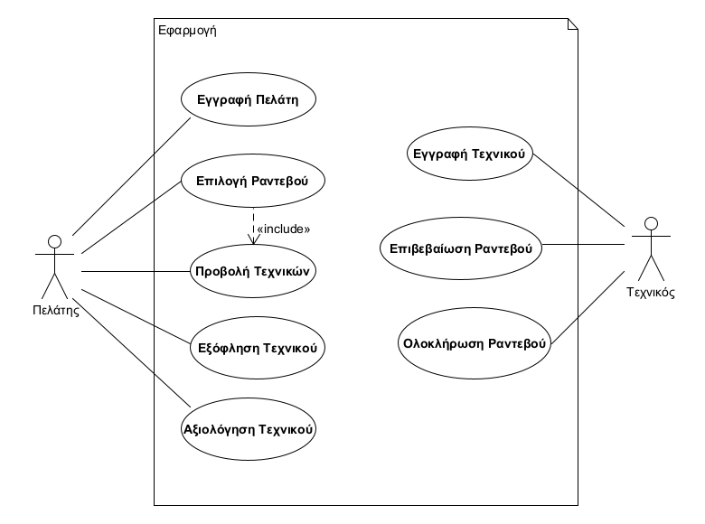
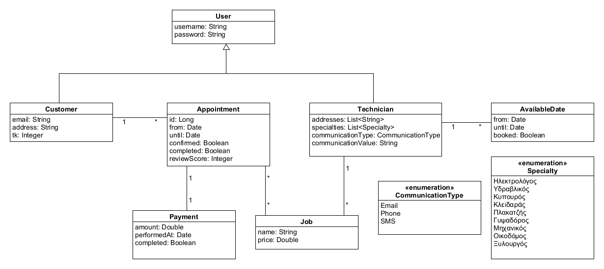
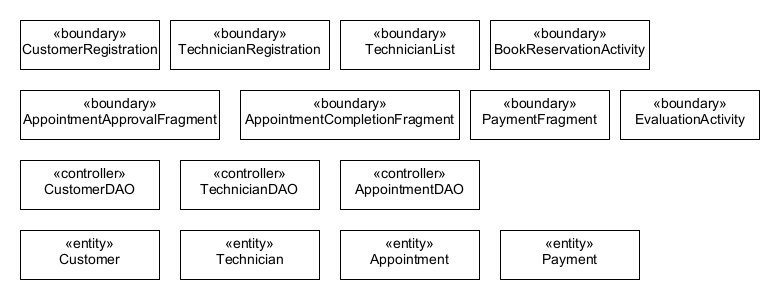

# Εισαγωγή

Στο παρόν έγγραφο δίνεται μία περιγραφή των απαιτήσεων του συστήματος της εφαρμογής εύρεσης τεχνικών.

## Εμβέλεια

\[*Περιγράφουμε τι θα κάνει και κυρίως τι δεν θα κάνει το λογισμικό. Βλέπε παράδειγμα 3-2 του βιβλίου στη σελίδα 139.*

*Ένα διάγραμμα περιβάλλοντος (πρωταρχικό διάγραμμα ροής δεδομένων) που βοηθά στην κατανόηση του συστήματος σε σχέση με το περιβάλλον του. Βλέπε το σχήμα 4-12 του παραδείγματος 4-1 στη σελίδα 185 του βιβλίου*\]

## Ορισμοί ακρώνυμα και συντομογραφίες

\[*Ένας πίνακας ακρωνύμων και συντομογραφιών που χρησιμοποιούνται στο έγγραφο. Ένας δεύτερος πίνακας με ορισμούς. Οι ορισμοί λαμβάνονται από το γλωσσάρι αν αυτό υπάρχει. Βλέπε πίνακα 3-5 του παραδείγματος 3-1 στη σελίδα 134.*\]

## Αναφορές

\[*Γράφουμε αν υπάρχουμε αναφορές σε άλλα έγγραφα (μελέτη σκοπιμότητας, ΕΠΑΣ, επιχειρησιακά μοντέλα κλπ). Σε περίπτωση που κάποια πληροφορία περιλαμβάνεται σε άλλο έγγραφο γίνεται η αναφορά στο άλλο έγγραφο και δεν επαναλαμβάνεται στο ΕΠΑΛ).*\]

## Επισκόπηση

\[*Γράφουμε πως οργανώνεται το υπόλοιπο έγγραφο*\]

# Συνολική περιγραφή

## Επισκόπηση μοντέλου περιπτώσεων χρήσης

\[*Εισάγουμε το διάγραμμα περιπτώσεων χρήσης. Βλέπε σχήμα 3-19 του παραδείγματος 3-11 στη σελίδα 168 του βιβλίου.*

*Εισάγουμε έναν πίνακα με τους κωδικούς, τους τίτλους και μία σύντομη περιγραφή των περιπτώσεων χρήσης. Βλέπε πίνακα 3-8 του παραδείγματος 3-11 στη σελίδα 168 του βιβλίου*\]

## Υποθέσεις και εξαρτήσεις

Υποθέτουμε ότι το σύστημα δεν είναι σε θέση να επικοινωνήσει με τους χρήστες παρά μόνο μέσω email. Για αυτόν τον λόγο υποθέτουμε πως υπάρχει κάποιος υπάλληλος ή κάποιο τηλεφωνικό κέντρο, το οποίο αναλαμβάνει να ενημερώσει τους τεχνικούς μέσω SMS ή μέσω τηλεφώνου για νέα ραντεβού.

# Ειδικές Απαιτήσεις 

## Περιπτώσεις χρήσης

### Οι ενδιαφερόμενοι και οι ανάγκες τους

\[*Ένας πίνακας των ενδιαφερομένων (stakeholders) με τις ανάγκες τους. Βλέπε πίνακα 3-6 του παραδείγματος 3-2 στη σελίδα 138 του βιβλίου.*\]

### Actors του συστήματος

| Actor     | Περιγραφή |
| ---       |   ---     |
| Πελάτης   | Οποιοσδήποτε χρήστης της εφαρμογής που ενδιαφέρεται να κλείσει ραντεβού με κάποιο τεχνικό. Μπορεί να είναι εγγεγραμμένος ή μη εγγεγραμμένος πελάτης. |
| Τεχνικός  | Οι χρήστες, οι οποίοι εξηπηρετούν τα ραντεβού των πελατών. |

### Περιγραφές περιπτώσεων χρήσης

#### [ΠΧ1 Εγγραφή Πελάτη](uc1-client-registration.md)

#### [ΠΧ2 Εγγραφή Τεχνικού](uc2-technician-registration.md)

#### ΠΧ3 Προβολή Τεχνικών

#### [ΠΧ4 Επιλογή Ραντεβού](uc4-appointment-selection.md)

#### [ΠΧ5 Επιβεβαίωση Ραντεβού](uc5-appointment-confirmation.md)

#### ΠΧ6 Ολοκλήρωση Ραντεβού

#### ΠΧ7 Εξόφληση Τεχνικού

#### ΠΧ8 Αξιολόγηση Τεχνικού

## Συμπληρωματικές προδιαγραφές

### Απαιτήσεις διεπαφών

#### Διεπαφές χρήστη

| Περίπτωση χρήσης  | Επεξήγηση |
| :----:            | ----      |
| 2                 | Υπάρχει μία λίστα με όλες τις διαθέσιμες κατηγορίες. Ο τεχνικός κατά την διάρκεια της εγγραφής επιλέγει όσες κατηγορίες θέλει κάνοντας κλικ στο **checkbox** που υπάρχει δίπλα από κάθε κατηγορία. |
| 2                 | Για την εισαγωγή μίας περιοχής εξυπηρέτησης, η διεπαφή διαθέτει ένα κενό box μέσα στο οποίο ο χρήστης γράφει την το όνομα της περιοχής. Πατώντας ένα διπλανό **σύμβολο προσθήκης**, ο τεχνικός μπορεί να προσθέσει παραπάνω περιοχή. Κάθε νέα περιοχή συνεπάγεται και ένα κλικ του συμβόλου προσθήκης περιοχής. Είναι απαραίτητο να επιλέξει τουλάχιστον μία περιοχή. |
| 3                 | Οι τεχνικοί εμφανίζονται σε μορφή λίστας, ο ένας κάτω από τον άλλο. Αριστερά βρίσκεται το όνομα και η ειδικότητα του τεχνικού και όταν γίνει κλικ στον τεχνικό εμφανίζονται και οι διαθέσιμες ημερομηνίες για ραντεβού. Οι ημερομηνίες εμφανίζονται είτε σε **popup** κουτί ή σε **νέο παράθυρο** διεπαφής. |

#### Διεπαφές υλικού

\[*Βλέπε πίνακα 5-2 του παραδείγματος 5-1 στη σελίδα 305*\]

#### Διεπαφές επικοινωνίας

| Περίπτωση χρήσης  | Επεξήγηση |
| :----:            | ----      |
| 5                 | Η επιβεβαίωση ενός ραντεβού γίνεται αρχικά με ειδοποίηση του τεχνικού μέσω του τρόπου επικοινωνίας που εκείνος έχει επιλέξει. Έπειτα, ο τεχνικός μπαίνει στην εφαρμογή, πηγαίνει στο τμήμα με τα μη επιβεβαιωμένα(νέα) ραντεβού του λογαριασμού του. Εκεί επιβεβαιώνει ή απορρίπτει το ραντεβού πατώντας το κατάλληλο **κουμπί**. |

#### Διεπαφές λογισμικού

| Περίπτωση χρήσης  | Επεξήγηση |
| :----:            | ----      |
| 8                 | Για την αξιολόγηση των τεχνικών, το σύστημα χρησιμοποιεί μία **κυλιόμενη μπάρα**, η οποία έχει τιμές από το 1 εώς το 10. |

### Περιορισμοί σχεδίασης και υλοποίησης

Το σύστημα δεν είναι σε θέση να ενημερώσει τον τεχνικό για νέα ραντεβού μέσω τηλεφώνου και SMS. Για αυτό το λόγο είναι απαραίτητη η ανθρώπινη παρέμβαση για την ενημέρωση με αυτά τα μέσα.

### Ποιοτικά χαρακτηριστικά

#### Απόδοση

* Το σύστημα χρησιμοποιεί **νήματα** για να επιταχύνει σχετικά απλές λειτουργίες, όπως είναι η ενημέρωση για νέα ραντεβού, η αποστολή email και η επιβεβαίωση ενός ραντεβού.

#### Διαθεσιμότητα

* Το σύστημα βασίζεται πλήρως στην εφαρμογή που διαθέτουν οι καταναλωτές(πελάτες και τεχνικοί), άρα είναι **πάντα** διαθέσιμο.
* Η διαθεσιμότητα των τεχνικών εξαρτάται από τους ίδιους.

#### Ασφάλεια

* Κάθε λογαριασμός, είτε ανήκει σε πελάτη είτε σε τεχνικό, είναι απαραίτητο να διαθέτει έναν **κωδικό**.
* Κάθε κωδικός λογαριασμού πρέπει να είναι τουλάχιστον 8 χαρακτήρες σε μέγεθος.
* Το σύστημα δεν κρατάει αποθηκευμένους τους κωδικούς σε plain text μορφή, αλλά χρησιμοποιεί τον αλγόριθμο **SHA1** για να τους κρυπτογραφήσει και τους αποθηκεύει σε αυτή την μορφή.
* Κατά την σύνδεση ενός χρήστη, το σύστημα κρυπτογραφεί με SHA1 τον κωδικό και συγκρίνει το αποτέλεσμα του αλγορίθμου με αυτό που έχει αποθηκεύσει. Εάν δεν ταιριάζουν, δεν ολοκληρώνεται η διαδικασία της σύνδεσης.
* Για την εγγραφή ενός χρήστη είναι απαραίτητο να δωθεί δύο φορές ο κωδικός πρόσβασης. Με αυτό τον τρόπο βεβαιώνεται ο χρήστης ότι δεν έχει κάνει κάποιο τυπογραφικό λάθος κατά την πληκτρολόγηση του κωδικού.

#### Ευελιξία

\[*Βλέπε πίνακα 5-4 του παραδείγματος 5-1 στη σελίδα 306*\]

#### Ευχρηστία

* Η διεπαφή της εφαρμογής υλοποιείται με απλό μινιμαλιστικό UI, κάνοντας την πιο εύχρηστη.
* Στην ΠΧ8 χρησιμοποιείται κυλιόμενη μπάρα για την αξιολόγηση του τεχνικού. Αυτό καθιστά την χρήση της εφαρμογής πιο εύκολη.

# Υποστηρικτικό υλικό

## Μοντέλο πεδίου

## Ανάλυση περιπτώσεων χρήσης
--------------------------

### Κλάσεις ανάλυσης

### Συμπεριφορές

#### ΠΧ4 - Επιλογή Ραντεβού

#### ΠΧ5 - Επιβεβαίωση Ραντεβού

## Άλλα μοντέλα
------------

\[*Άλλα μοντέλα όπως για παράδειγμα διαγράμματα μηχανής καταστάσεων, πίνακες απόφασης κλπ. Βλέπε παράδειγμα 4-6 του βιβλίου*\]

## Επιχειρησιακοί κανόνες

\[*Ένας πίνακας με του επιχειρησιακούς κανόνες. Βλέπε πίνακα 3-4 του παραδείγματος 3-1 στη σελίδας 133 του βιβλίου.*\]

| Επιχειρησιακοί κανόνες | Περιγραφή |
| :----------------------| :---------|
| ΕΚ1 | O Αριθμός Δελτίου Ταυτότητας και το ΑΦΜ είναι μοναδικά για κάθε πελάτη 
| ΕΚ2 | Όλα τα στοιχεία του πελάτη είναι υποχρεωτικά, με εξαίρεση τον αριθμό Fax
| ΕΚ3 | Η ηλικία του πελάτη θα πρέπει να είναι μεγαλύτερη των 18 ετών